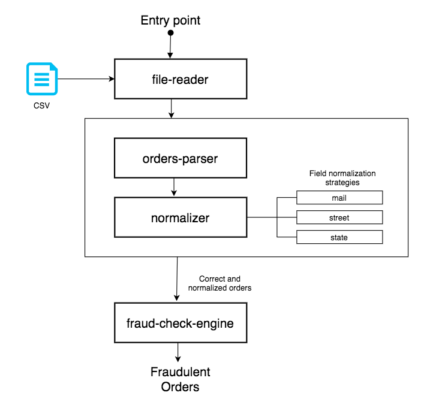
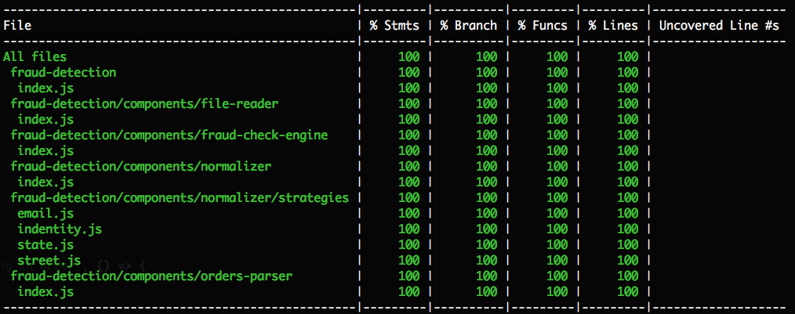

# Proposed solution

### Solution architecture

### Main attack points

- Extracted logic with same intention to modules (See architecture diagram)
- Refactored logic related with fraud detection to a single iteration with `O(n)` complexity (See `fraud-check-engine` component)
- Logic related with normalization has been refactored using a strategy pattern approach. With several strategies for each type of field. See `components/normalizer/strategies`
- Checks to make sure logic doesn't deal with `undefined` stuff, incomplete orders or no existent files has been implemented, especially in `normalizer`, `file-parser` and `order-parser`.
- 100% code coverage, for that, some extra tests where created. Especially for `normalizer`, `file-parser` and `order-parser` especially to consolidate previous point.

- `npm run test-coverage` script created on package.json to run mocha with code coverage report.
- Installed `commitizen` tool in order to simplify and standarize commmit messages.
- Installed `unroll` tool to simplify batch of assertions in tests, especially for `normalizer`.
- Following a dependency injection approach some changes where made:
  - Modules using dependencies receive those through `init()` method. Regarding injecting mock dependencies in tests, although with modern mocking libs (sinon/jest stubs and fakes for example) and/or `babel-plugin-rewire` this can be achieved, this way modules doesn't need to know relative location of their dependencies etc.
  - In this way a `bootstrap` method has been created on the app entry point `fraud-detection/index.js`, there, we instantiate base modules with their dependencies injected.
  - Continuing this approach a full dependency injection container could be created so all modules and their dependencies stay focused in one place, easing modules and/or dependencies replacement or relocation. That DIC would have some methods like `registerDependency` or `getDependency` etc. As always, there is no silver bullet and for the size of the project maybe could be overkilling though.
- `/config` folder created.
  - For normalizer module a `replacements.json` has been created containing the replacements. This makes extension and maintenance of the replacements easier.
  - A `base-config.json` has been created for the app itself to store things as the location of the file with orders. This has been the followed approach to avoid passing a file path to the entry point method. This way we can have or switch between several config files.

### Bug found here?

Without fully knowing all the domain for fraud detection, this has been considered as a bug, fix already implemented on solution:

`order.state = order.street.replace('il', 'illinois').replace('ca', 'california').replace('ny', 'new york')`

Original code permalink: https://github.com/payvision-development/recruitment-challenges/blob/1ff546e0609e79520421345222d2981257358e65/fraud-detection/FraudRadar.js#L37

### Things to improve / Nice to have

- Create a full dependency inyection container, commented on last attack point.
- State and street strategies are pretty similar maybe a common one could be made.
